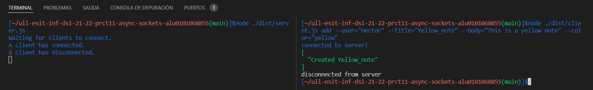
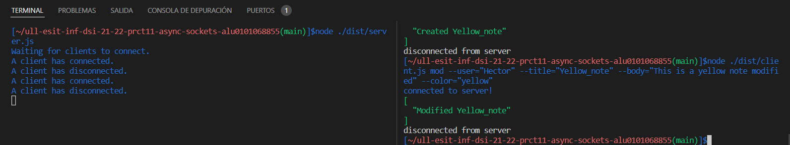
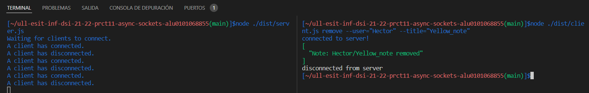
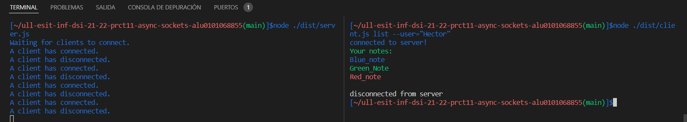
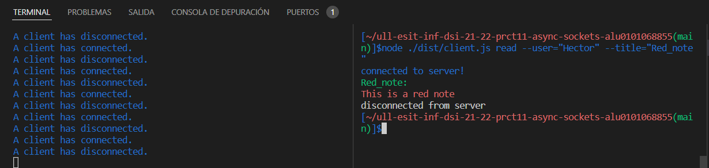
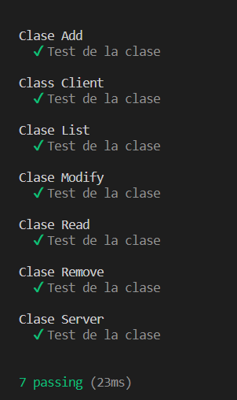

# Informe Práctica 11

Para esta práctica, se ha desarrollado la aplicación de procesamiento de notas de texto que se llevó a cabo en la Práctica 9 para escribir un servidor y un cliente haciendo uso de los sockets proporcionados por el módulo net de Node.js.

Las operaciones que podrá solicitar el cliente al servidor son las mismas que ya se implementó durante la Práctica 9, esto es, añadir, modificar, eliminar, listar y leer notas de un usuario concreto. Un usuario interactuará con el cliente de la aplicación, exclusivamente, a través de la línea de comandos. Al mismo tiempo, en el servidor, las notas se almacenarán como ficheros JSON en el sistema de ficheros y siguiendo la misma estructura de directorios utilizada durante la Práctica 9.

## Clases

Para el desarrollo de las 5 primeras clases, esto es, add, modify, remove, list y read de un usuario concreto, contamos con dos tipos de datos *ResponseType* y *RequestType*. Para cada una de las clases, su constructor consta de la petición del usuario y de la respuesta del servidor. Dichas clases retornan el *ResponseType* modificado.

- ***RequestType*** contiene la petición lanzada por el usuario.
  - **type** es un valor obligatorio y consta del tipo de petición del cliente.
  - **user** es un valor opcional y consta del nombre del usuario.
  - **title** es un valor opcional y consta del título del archivo.
  - **body** es un valor opcional y consta del cuerpo del archivo.
  - **color** es un valor opcional y consta del color del texto del archivo.

 Las peticiones varían en función de la petición que se quiera realizar, al igual que los argumentos a introducir por el cliente.

- ***ResponseType*** devuelve la respuesta del servidor al usuario.
  - **type** es un valor obligatorio y consta del tipo de petición.
  - **success** es un booleano que nos dice si la operación solicitada ha sido completada con éxito o no.
  - **notes**  es un valor opcional que se modifica según si la petición ha tenido éxito o no.

La respuesta del servidor consta del tipo de petición y una variable de éxito, por defecto inicializada en true, que se verá modificada si hay algún error. Si ha tenido éxito se escribe un mensaje en verde y si no, en rojo. Los mensajes se almacenan en la variable notes.

### Add

Para el caso de esta clase, se necesitan todos los parámetros de RequestType.
La clase add contiene un método llamado **addNote()** que es similar al de la práctica 9. Comprueba que el directorio esté creado mediante el uso del método **existSync** de **filesystem** (fs), en caso de que esté creado, se comprueba que el archivo no se encuentre y así crearlo con el nombre del *title* proporcionado por el cliente.
En caso de que haya algún error, el booleano *success* se cambia a false y se escribe el error en *notes*. Si no hay ningún error, se informa del éxito al cliente escribiendo el mensaje en *notes*.



*Imagen de ejemplo de uso de add*

### Modify

Al igual que la clase anterior, modify requiere todos los valores de RequestType.
Modify tiene un método **modify()** que comprueba que el archivo a modificar existe, si no es el caso, **success** es falso y retorna un mensaje de error escrito en **notes**. En caso de éxito notifica al cliente que se ha realizado con éxito el cambio.




*Imagen de ejemplo de uso de modify*

### Remove

Para el caso de remove, sólo se necesitan el *user* y el *title* del archivo a eliminar.
Contiene el método **remove()**, que comprueba que el archivo exista y luego se elimina y notifica al usuario. En caso contrario, se notifica al cliente del errror.




*Imagen de ejemplo de uso de remove*

### List

Para list, sólo es necesario el nombre del *user* y comprueba con su método **list()** que el directorio exista y en caso favorable, se realiza un push con los nombres de los archivos del directorio a *notes* y se notifica al cliente. En caso de error se notifica al usuario.




*Imagen de ejemplo de uso de list*

### Read

Para el caso del read, se comprueba primeramente con su método **read()** que el archivo existe. En caso afirmativo y al tratarse de la lectura de un único archivo, el objeto **a** se modifica para tener todo el contenido y así poder leer el **body** del archivo, que es introducido a *notes*.

```typescript
this.a = require(`../${this.a.user}/${this.a.title}.json`);
this.b.notes?.push(`${this.a.body}`);
```



*Imagen de ejemplo de uso de read*

### Client

La clase **Client** contiene el tipo **RequestType**, los **yargs.commands** de cada uno de los posibles tipos de acciones y el método **start()**. La parte importante se encuentre en el *handler*, al que le escribimos el tipo de petición que es proporcionada por el usuario a **object**. Luego se crea una conexión con el servidor al puerto que le hemos asignado, en este caso el 60300. Una vez conectados, muestra al cliente el mensaje de *conected to server!*. Con el **client.write** le mandamos la petición al servidor y esperamos la respuesta con el **client.on('data')** que nos devuelve la información recivida del servidor y luego se cierra la conexión, por eso no se ha realizado el request del cliente, porque recibe la información que tenga que enviar el servidor y la muestra por la consola del cliente y luego se cierra la conexión con **client.end()**. Cuendo se cierra la conexión con el cliente, muestra el mensaje al cliente de *disconnected from serever*.

```typescript
handler(argv) {
  let object: RequestType = {
    type: `mod`,
    user: `${argv.user}`,
    title: `${argv.title}`,
    body: `${argv.body}`,
    color: `${argv.color}`
  }
  const client = net.createConnection({ port: 60300 }, () => {
    console.log('connected to server!');
    client.write(`${JSON.stringify(object)}`);
  });
  client.on('data', (data) => {
    console.log(`${data}`);
    client.end();
  });
  client.on('end', () => {
    console.log('disconnected from server');
  });
}
```
*Ejemplo del handler para la operación add*

### Server

La clase Server contiene el **ResponseType** que devuelve el resultado de la operación solicitada por el cliente y el **RquestType** que es la petición de este y el método **start()**. Primero se crea el servidor y se queda escuchando en el puerto 60300, que muestra el mensaje: *Waiting for clients to connect*. En el caso de que se conecte un cliente lo muestra por la consola del servidor y una vez enviada la respuesta, muestra que el cliente se ha desconectado por la consola del servidor.

Cuando recibe la petición de un usuario, se crea **a** que es traducido con **JSON.parse(data.toString())**. Después de tener la petición del cliente, se crea el objeto **b** y se modifica el **type** con el **type** del request. **success** por defecto se queda en true y **notes** es un array de strings vacío. Luego se comprueba la petición del cliente y se crea un objeto en función de su petición, al que se le pasan los parámetros de petición y respuesta. Finalmente se realiza el método apropiado de la clase creada por el **type** proporcionado y en caso de tener éxito, se escribe un mensaje en verde al cliente y en caso de no tener éxito (**success** = false), se escribe el mensaje al cliente en rojo.


```typescript
start(){       
net.createServer((connection) => {
  console.log('A client has connected.');

  connection.on('data', (data) => {
    let a: RequestType = JSON.parse(data.toString());
    let b: ResponseType = {
      type: `${a.type}`,
      success: true,
      notes: []
    }

    if (b.type === 'add'){
      let c = new Add(a, b);
      c.addNote();
    }

    if (b.type === 'mod'){
      let c = new Modify(a, b);
      c.modify();
    }

    if (b.type === 'remove'){
      let c = new Remove(a, b);
      c.remove();
    }

    if (b.type === 'read'){
      let c = new Read(a, b);
      c.read();
      if (b.success === true){
        a = require(`./${a.user}/${a.title}.json`);
        connection.write(chalk.green(`${a.title}:\n`));
        connection.write(chalk[`${a.color}`](b.notes?.toString()));
      }
    }

    if (b.type === 'list'){
      let c = new List(a, b);
      c.list();
        setTimeout(() => {
          if (b.success === true){
            connection.write(chalk.green(`Your notes:`));
            b.notes?.forEach(element => {
              a = require(`./${a.user}/${element}`);
              connection.write(chalk[`${a.color}`](a.title) + '\n');
            })
          }
        }, 1000);
    }

    if ( b.success === true ){
      if (b.type === 'add' || b.type === 'mod' || b.type === 'remove'){
        connection.write(chalk.green(`${JSON.stringify(b.notes, null, 2)}`));
      }
    }
    else {
      connection.write(chalk.red(`Error: ${JSON.stringify(b.notes, null, 2)}`));
    }
    //console.log(b.notes);
  });

  connection.on('close', () => {
    console.log('A client has disconnected.');
  });

}).listen(60300, () => {
  console.log('Waiting for clients to connect.');
});
}
```

***NOTA:*** En el caso de read y list se han implementado de manera diferente, ya que para estas funciones, se escriben los menasjes en otro color. 

## Tests

Para el desarrollo de las pruebas, se han creado y ejecutado objetos de las clases y mediante **fs.existSync** y **success** se comprueba que el funcionamiento de sus métodos haya sido el correcto.




*Imagen de test por consola*